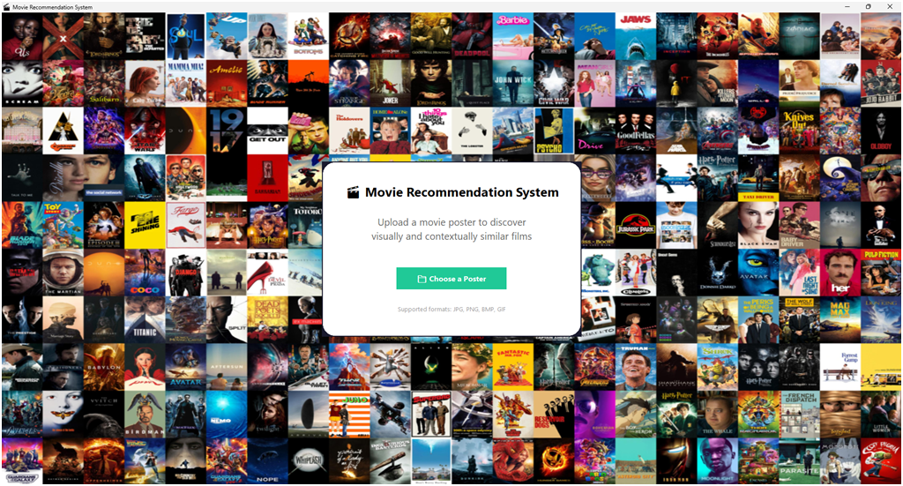
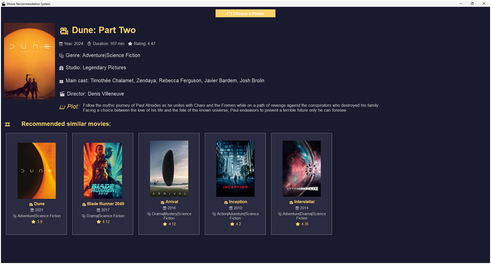

**Graphical User Interface**

The user interface, developed in Tkinter, enables non-technical users to interact with the system through a simple and elegant layout.

Key features:
- Poster Upload: Users select an image file representing a movie poster.
- Preview: The system displays the uploaded image.
- Metadata Display: The corresponding movie’s title, genre, cast, plot, and release date are shown.
- Recommendations: Semantically similar movies are presented with thumbnails and titles.
- Usability: Emojis and modern fonts enhance user engagement.

The GUI integrates all system components behind the scenes, making it intuitive to use and requiring no external configuration.
        

